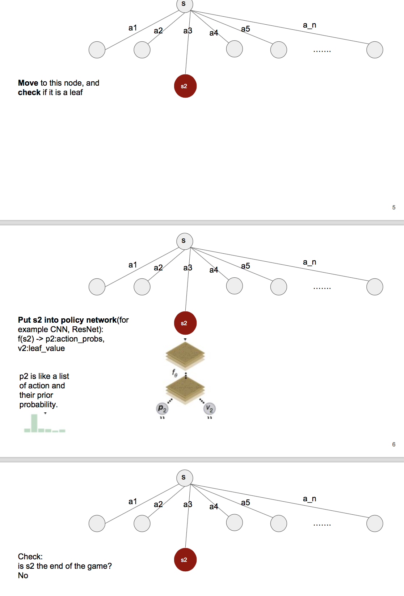
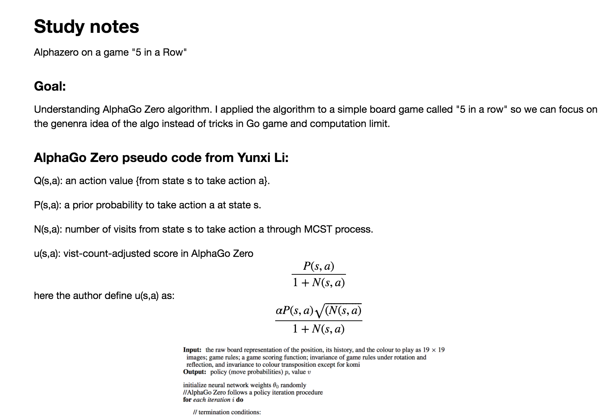

# AlphaGO Zero

This repository contains a group of study material of AlphaZero algorithm.

## Paper

[Mastering the game of Go with deep neural networks and tree search](https://github.com/edchengg/alphazero_learning/blob/master/Paper/Mastering%20the%20game%20of%20Go%20with%20deep%20neural%20networks%20and%20tree%20search.pdf),

[Matering the game of Go without human knowledge](https://github.com/edchengg/alphazero_learning/blob/master/Paper/Matering%20the%20game%20of%20Go%20without%20human%20knowledge.pdf),

[PseudoCode of AlphaGo Zero](https://github.com/edchengg/alphazero_learning/tree/master/Paper)

## PPT slides

### PPT slides from Harvey Huang:

[PPT](https://github.com/edchengg/alphazero_learning/blob/master/PPT/alphaGo_v2.pdf)

### Visualization of AlphaGo Zero algorithm

[PPT](https://github.com/edchengg/alphazero_learning/blob/master/PPT/Alphazero_PPT.pdf)

## Python Notebook:

The notebook contains a series of note and code in each part of the Alpha Zero algorithm:

[Notebook](https://github.com/edchengg/alphazero_learning/blob/master/Notebook/AlphaZero.ipynb).

1. PesudoCode of AlphaZero
2. Tree Node class
3. Monte Carlo Tree Search class
4. MCTS Player class
5. Game class
6. Training class

## Blog post

The following blog posts are quite useful during the study of the algorithm.

pesudo code: https://www.jiqizhixin.com/articles/2017-11-02-18 

MCTS: http://tim.hibal.org/blog/alpha-zero-how-and-why-it-works/
